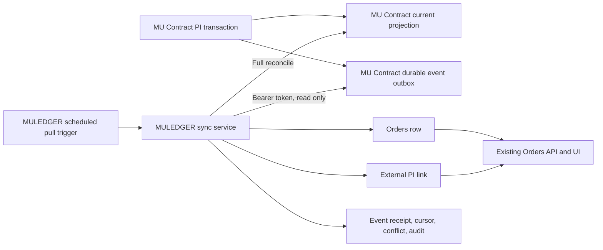

# MU Contract PI to MULEDGER Orders Synchronization Design

Date: 2026-07-17

Status: Approved; implementation is on isolated branches and is not deployed or enabled

## 1. Purpose

Synchronize PI order information from MU Contract into the independent `Orders` page in MULEDGER without changing financial invoice, receipt, payment-detail, SWIFT, balance, or matching behavior.

The synchronization creates or links one MULEDGER `OrderTracker` row per `ORDER NO`. It does not copy PI product lines. The stable cross-system identity is the hidden MU Contract PI ID; `ORDER NO` remains the unique business key and may be renamed later for the same PI ID.

## 2. Confirmed Business Rules

1. A user-created MULEDGER Orders row has permanent priority over a synchronized row with the same normalized `ORDER NO`.
2. Linking an existing user-created row to a PI adds external source metadata only. It does not change that row's manual origin, creator, ownership, customer, status, `PI STATUS`, remark, system note, or confirmation date.
3. A missing `ORDER NO` creates a new synchronized Orders row with status `In progress`, unchecked `PI STATUS`, blank remark, blank system note, and blank confirmation date.
4. A synchronized row with no customer match is still created. It is visible only to administrators until a customer is resolved. Customer matching retries later.
5. Customer matching uses MULEDGER's existing global ORDER NO matcher, including the established normalization and composite-order rules. The integration must not introduce a second matching formula.
6. Only a successfully generated or regenerated formal PI PDF supplies the official PI amount. Draft edits do not change the amount shown in MULEDGER.
7. The official amount is stored to two decimal places. The Orders UI displays it using the existing rounded, no-decimal international USD formatter. Unknown amounts display `-` rather than zero.
8. PI creation time is transferred as an absolute UTC timestamp and displayed as a date in `Africa/Conakry`.
9. Later synchronization never resets a status, `PI STATUS`, remark, system note, confirmation date, or customer that a user has modified.
10. If the same PI ID changes `ORDER NO`, its linked MULEDGER row is renamed when no collision exists.
11. On a rename collision, a manual row wins. An untouched sync-created row may transfer its PI link to the manual row and be archived. A human-edited sync-created row is not archived automatically; an administrator conflict is recorded instead.
12. Deleting a PI or clearing its ORDER NO never deletes a MULEDGER Orders row. The external source link is marked inactive/deleted and history remains available.
13. Existing MULEDGER-only Orders remain untouched and display `-` for PI creation date and PI amount.

## 3. Scope

### Included

- A durable MU Contract outbox and current-state projection for MULEDGER.
- Read-only authenticated MU Contract integration APIs.
- A MULEDGER pull worker with durable cursor, locking, retries, idempotency, conflict isolation, and audit records.
- Initial historical reconcile with preview and explicit apply.
- Orders page PI creation date and official amount columns.
- A collapsible administrator-only `MU Contract Sync` settings section.
- API-first automated tests in both repositories.
- Additive migrations, backup documentation, rollback instructions, and isolated restore/migration rehearsal.

### Excluded

- PI product-line synchronization.
- Creating or changing financial `Order`, `Invoice`, receipt, payment-detail, SWIFT, or balance records.
- Updating MULEDGER from MU Contract draft autosave values.
- Sending MULEDGER changes back to MU Contract.
- Automatically resolving business conflicts by overwriting a manual order.
- Deleting Orders because their MU Contract source disappeared.

## 4. Architecture



MU Contract owns PI facts and emits a durable event in the same database transaction as each synchronization-worthy change. MULEDGER pulls rather than accepting public webhooks. This avoids inbound exposure, tolerates weak or interrupted connectivity, and lets MULEDGER resume from its last committed cursor.

The MULEDGER browser never calls MU Contract directly. All secrets and cross-system requests remain server-side.

## 5. MU Contract Source Model

MU Contract adds two PostgreSQL tables with names adapted to its existing naming conventions.

### `MuLedgerOrderProjection`

One durable current-state row per PI:

| Field | Meaning |
| --- | --- |
| `sourcePiId` | Stable hidden `BusinessPiRecord.id`, primary key |
| `sourceVersion` | Monotonic per-PI integer incremented for every emitted change |
| `orderNo` | Current trimmed ORDER NO, nullable after unlink |
| `normalizedOrderNo` | MU Contract diagnostic normalization only; MULEDGER remains authoritative for matching |
| `piCreatedAt` | PI creation timestamp in UTC |
| `officialAmount` | Last successfully generated formal PI total, nullable, decimal(18,2) |
| `currency` | Currency associated with the official amount, nullable |
| `officialGeneratedAt` | Successful formal generation timestamp, nullable |
| `officialGenerationRunId` | Stable successful formal generation run ID, nullable |
| `active` | False after PI delete or ORDER NO unlink |
| `sourceDeletedAt` | Delete/unlink timestamp, nullable |
| `updatedAt` | Projection update timestamp in UTC |

The projection remains as a tombstone after source deletion so Full Reconcile can repeat safely.

### `MuLedgerOrderEvent`

Append-only outbox:

| Field | Meaning |
| --- | --- |
| `cursor` | Database-generated monotonic 64-bit sequence |
| `eventId` | Globally unique UUID |
| `sourcePiId` | Stable PI ID |
| `sourceVersion` | Per-PI version represented by this event |
| `eventType` | One of the four version-1 event types |
| `payload` | Immutable version-1 event JSON |
| `occurredAt` | Event transaction time in UTC |

Projection update and event insertion occur in the same transaction as the relevant PI operation. No network request to MULEDGER occurs inside the PI request transaction.

## 6. Event Creation Rules

Events are emitted only for these completed source operations:

| Event | Trigger |
| --- | --- |
| `PI_ORDER_LINKED` | A PI first receives a non-empty ORDER NO |
| `PI_ORDER_RENAMED` | The ORDER NO changes from one non-empty normalized value to another |
| `PI_FORMAL_PDF_GENERATED` | `/real-flow/pi/generate` completes successfully and the authoritative rendered snapshot is persisted |
| `PI_SOURCE_DEACTIVATED` | The PI is deleted or its ORDER NO is cleared |

Ordinary draft autosave does not emit an event. Failed PDF generation does not emit an amount event. A successful regeneration emits `PI_FORMAL_PDF_GENERATED` even when the value is unchanged, providing an auditable official generation revision.

The amount comes from the persisted formal generation snapshot or corresponding `BusinessWorkflowRun`, never from a later mutable draft total.

### Historical source projection

MU Contract includes an idempotent `backfill_muledger_order_projection` management command. It inserts projection rows for PI IDs that do not yet have one, reads the most recent provable successful formal generation snapshot for the official amount, and never reads a mutable draft total. Historical rows begin at source version `1`; the backfill does not manufacture historical outbox events. If a live event already created a projection with no official amount, backfill may fill only those still-null official amount fields from the proven historical formal snapshot. It never changes that live projection's ORDER NO, active state, source version, or existing non-null official amount. The initial MULEDGER Full Reconcile consumes these rows from the snapshot feed.

The source schema and event-writing code are deployed before this command runs. If a live PI transaction creates a projection first, the command preserves its live state and may only enrich missing proven formal amount metadata. If the command inserts first, the next live event atomically advances that projection to version `2`. This makes the backfill safe to rerun without pausing ordinary PI use.

## 7. Version 1 Integration Contract

### Authentication

MU Contract receives a dedicated read-only bearer secret in an environment variable. MULEDGER receives the same secret only in its server-side environment. The token is not stored in `SystemSetting`, returned by an API, logged, or rendered in the browser.

All integration responses set `Cache-Control: no-store`. Authentication failures return `401`; an invalid or expired cursor returns `400`; unsupported schema negotiation returns `409` with a human-readable error code.

### Event feed

```text
GET /integrations/muledger/order-events?after=<cursor>&limit=<batch>
Authorization: Bearer <dedicated integration token>
```

`after` is the last successfully committed cursor and is exclusive. It is omitted only for the first event pull. `limit` is constrained to `1..500`. Cursor values are decimal strings in JSON to avoid JavaScript 64-bit precision loss.

```json
{
  "schemaVersion": 1,
  "events": [
    {
      "cursor": "1042",
      "eventId": "c5a5c257-b3ec-4ce2-b54d-83f8f1aab7e2",
      "eventType": "PI_FORMAL_PDF_GENERATED",
      "reason": "FORMAL_PDF_REGENERATED",
      "occurredAt": "2026-07-17T14:30:00.000Z",
      "source": {
        "system": "MU_CONTRACT",
        "piId": "stable-hidden-pi-id",
        "version": 4
      },
      "order": {
        "orderNo": "SUPER DT2-16",
        "previousOrderNo": null,
        "piCreatedAt": "2026-07-16T10:00:00.000Z",
        "active": true,
        "deletedAt": null
      },
      "officialAmount": {
        "currency": "USD",
        "value": "30040.00",
        "generatedAt": "2026-07-17T14:30:00.000Z",
        "generationRunId": "formal-generation-run-id"
      }
    }
  ],
  "nextCursor": "1042",
  "hasMore": false
}
```

Every event is a complete current source snapshot, not a partial patch. `reason` is one of `ORDER_ASSIGNED`, `ORDER_CHANGED`, `FORMAL_PDF_GENERATED`, `FORMAL_PDF_REGENERATED`, `PI_DELETED`, or `ORDER_UNLINKED`. For an ORDER NO rename, `previousOrderNo` contains the immediately preceding value. For a PI that has never completed formal generation, `officialAmount` is `null`. A deactivation event carries the last known ORDER NO, `active: false`, and `deletedAt`. A generated amount includes the stable formal generation run ID used to obtain it.

### Snapshot feed

```text
GET /integrations/muledger/order-snapshot?after=<opaque-page-cursor>&limit=<batch>
Authorization: Bearer <dedicated integration token>
```

The snapshot contains projection rows ordered by immutable PI ID, including inactive tombstones. Its first page returns `eventHighWatermark`, the largest event cursor visible when that scan started. Each row uses the same `source`, `order`, and `officialAmount` structure as an event. The response returns `nextAfter` and `hasMore`.

MULEDGER processes snapshot rows by per-PI `source.version`, then resumes the event feed after `eventHighWatermark`. A row or event with a lower version than an already applied version is ignored. This makes a reconcile safe when source changes happen during pagination.

The exact version-1 JSON Schema and representative fixtures are committed in both repositories and exercised by contract tests.

## 8. MULEDGER Persistence Model

The Prisma model names and responsibilities below are the implementation contract.

### `ExternalOrderSourceLink`

One external PI association:

| Field | Meaning |
| --- | --- |
| `provider` + `externalId` | Unique source key, `MU_CONTRACT` plus PI ID |
| `orderTrackerId` | Current linked Orders row, nullable only while a conflict is unresolved |
| `sourceVersion` | Highest applied per-PI version |
| `sourceOrderNo` / `normalizedSourceOrderNo` | Current source ORDER NO |
| `piCreatedAt` | Source PI creation timestamp |
| `officialAmount` | Nullable decimal(18,2) official PI amount |
| `currency` / `officialGeneratedAt` | Amount metadata |
| `active` / `sourceDeletedAt` | Source lifecycle without deleting the Orders row |
| `linkMode` | `MANUAL_ATTACHED` or `SYNC_CREATED` |
| `humanEditedAt` / `humanEditedBy` | Whether a sync-created row has received a human edit |
| `customerMatchStatus` | `MATCHED`, `UNMATCHED`, or `CONFLICT` |
| `lastEventCursor` | Last source cursor applied to this link |
| timestamps | First seen, last source update, created, and updated times |

There is a unique constraint on `(provider, externalId)` and on `(provider, orderTrackerId)`. Official PI amount remains nullable in this link because existing `OrderTracker.amount` cannot distinguish unknown from zero.

### `IntegrationSyncState`

One row per provider stores `committedCursor`, `lastAttemptAt`, `lastSuccessAt`, `lastErrorCode`, `lastErrorMessage`, `nextEligiblePollAt`, `leaseOwner`, `leaseExpiresAt`, `reconcileStatus`, `reconcileCursor`, `reconcileHighWatermark`, `initialReconcileCompletedAt`, and `serviceActorId`. `serviceActorId` is the administrator who first enables or applies the integration and supplies required creator/audit attribution for scheduled work. The cursor changes only in the same transaction as a successfully handled event receipt.

### `IntegrationEventReceipt`

One row per `(provider, eventId)` stores cursor, source PI ID/version, payload hash, result (`APPLIED`, `IGNORED_STALE`, or `BUSINESS_CONFLICT`), linked Orders ID, and processing timestamps. This is the durable idempotency and forensic record.

### `IntegrationSyncConflict`

Conflicts record source PI ID/version, event ID/cursor, type, current ORDER NO, target Orders IDs, human-readable summary, structured evidence, status, and resolution audit fields. Version 1 conflict types are `INVALID_SOURCE_DATA`, `ORDER_NO_COLLISION`, `SOURCE_LINK_COLLISION`, `HUMAN_EDITED_RENAME_COLLISION`, `CUSTOMER_MATCH_CONFLICT`, and `UNSUPPORTED_CURRENCY`. Status is `OPEN` or `RESOLVED`; a later event or Full Reconcile automatically resolves a conflict only after its underlying condition has disappeared. Version 1 has no force-overwrite action. Business conflicts do not block later feed events.

### `IntegrationReconcilePreview`

One short-lived administrator confirmation record stores provider, source high-watermark, snapshot summary, summary hash, creator, creation time, 15-minute expiry, and consumed time. Apply accepts only an unexpired, unconsumed preview whose current source high-watermark still matches. If source state changed, the API returns a readable `409` and requires a new preview rather than applying materially different counts without review.

### Orders archival

`OrderTracker` receives nullable `archivedAt` and `archiveReason`. Normal Orders queries exclude archived rows. Archival is used only when an untouched sync-created row transfers its source link to a higher-priority manual row. No row is physically deleted.

## 9. Event Processing and Transaction Rules

1. Acquire a database-backed lease for provider `MU_CONTRACT`. Concurrent scheduled, `Sync Now`, and reconcile attempts return the running status rather than processing twice.
2. Read enabled, interval, and batch-size settings. Scheduled runs stop without side effects when disabled or before `nextEligiblePollAt`.
3. Fetch the feed after the committed cursor with a 15-second request timeout, at most three attempts, exponential delay, and a bounded response body.
4. Validate schema version, cursor ordering, event identity, timestamps, ORDER NO, decimal amount, and currency before processing.
5. Process each event in its own database transaction under a renewable 120-second lease.
6. Skip an already-received `eventId` idempotently and move to its recorded cursor only when cursor ordering remains valid.
7. Ignore a lower per-PI source version as stale, record the receipt, and advance the cursor.
8. Apply a valid event, record before/after audit evidence, insert the event receipt, and update the committed cursor atomically.
9. Convert deterministic business problems into an open conflict plus `BUSINESS_CONFLICT` event receipt, then advance the cursor so one bad PI cannot stop unrelated PIs.
10. On network, source `5xx`, timeout, database, or transaction failure, do not insert a receipt and do not advance the cursor. Release or expire the lease and retry on the next run.
11. A supported version with identifiable but invalid business data becomes `INVALID_SOURCE_DATA` and advances safely. An unsupported contract version stops the batch without advancing the cursor. It is an integration compatibility failure, not a skippable business conflict.
12. Source outbox rows and MULEDGER event receipts are retained indefinitely in version 1. Their expected volume is low and they form the durable audit trail; no cleanup job is introduced without a separately designed cursor-safe retention policy.

Only USD official amounts are displayed in the current Orders USD column. A non-USD formal PI is retained as a business conflict with its original amount metadata; MULEDGER does not silently convert or mislabel it.

## 10. Linking, Creating, Renaming, and Deactivating

### First encounter

- Normalize ORDER NO with MULEDGER's shared order-name kernel.
- If one active manual `OrderTracker` already has that normalized value, attach metadata with `linkMode: MANUAL_ATTACHED` and do not overwrite business fields.
- If no row exists, create a `SYNC_CREATED` row, then run the shared customer resolver.
- If more than one candidate or another source link conflicts, create a business conflict and make no destructive change.

### Customer resolution

- Existing manual rows keep their current customer fields.
- New sync-created rows use the same pure matching kernel as `resolveOrderCustomer`. The integration wrapper supplies global system scope rather than a browser user's hierarchy, but it does not implement a new normalization or matching formula.
- A successful match fills customer and finance-order references using existing Orders service conventions.
- An unsuccessful match leaves the customer blank, sets `needsCustomerFix`, and keeps the row administrator-only.
- Matching retries on later source events and every Full Reconcile while the row remains unresolved.
- Once a user chooses a customer, later synchronization does not overwrite it.

### Rename for the same PI ID

- With no target collision, rename the linked row and refresh only source-owned fields. Preserve all user-owned fields.
- If the target is a manual row and the current sync-created row has never been human-edited, archive the old row, transfer the source link to the manual row, and preserve the manual row unchanged.
- If the current sync-created row has human edits, or the target belongs to a different PI source link, record an administrator conflict and leave both rows unchanged.
- The stable PI ID prevents a rename from creating a second source identity.

### Deactivation

- Mark the link inactive and preserve its last source data.
- Keep the Orders row and all user changes.
- Do not hide a still-relevant manual row merely because its PI source is inactive.
- A purely sync-created row remains visible with an inactive-source indicator unless it was previously archived through a collision transfer.

## 11. Initial Backfill and Full Reconcile

Initial rollout and later Full Reconcile use the same two-step process.

### Preview

The administrator requests a read-only snapshot comparison. It returns counts and itemized diagnostics for:

- existing manual rows that would receive source metadata;
- missing rows that would be created;
- sync-created rows that would be updated;
- inactive links;
- unmatched customers;
- rename or duplicate conflicts;
- MULEDGER-only manual rows that remain untouched.

The current preflight baseline is 53 MU Contract PI ORDER NOs, comprising 39 metadata-only links and 14 new Orders. Ten MULEDGER-only manual Orders remain untouched. These numbers are evidence for rollout validation, not hard-coded assertions.

### Apply

Apply requires a second explicit administrator confirmation tied to the preview identifier and source high-watermark. It processes bounded batches and persists the immutable-PI snapshot cursor after each batch. It does not change the normal event cursor while snapshot work is incomplete. After the final snapshot batch commits, it atomically sets the event cursor to at least the captured high-watermark, clears reconcile progress, and then consumes events after that high-watermark. A crash resumes from the persisted snapshot cursor. If source state has moved beyond the preview, per-PI versions and the subsequent event feed reconcile the difference.

`Full Reconcile` never invokes financial rematch, merges financial orders, deletes business rows, or changes balances.

## 12. Scheduling and Settings

A separate lightweight Docker service wakes every 5 seconds and triggers the internal MULEDGER sync endpoint. It does not connect to MySQL or MU Contract itself. The app enforces the persisted schedule and performs all transactions.

The trigger may wake at a short fixed cadence; `IntegrationSyncState.nextEligiblePollAt` and a database lease enforce the administrator-configured interval without requiring a container restart.

The collapsible administrator-only `MU Contract Sync` settings section contains:

- enabled toggle, default off;
- polling interval, default 30 seconds, bounded to `10..3600` seconds;
- batch size, default 100, bounded to `1..500`;
- last successful synchronization time;
- committed cursor;
- latest error summary;
- unmatched customer count;
- open conflict count;
- `Sync Now` action;
- `Full Reconcile` preview and confirmed apply action.

Changes to enabled, interval, and batch size use the existing audited `SystemSetting` path. Runtime state is read-only in the settings API. Only ADMIN accounts can view or control this section.

Synchronization cannot be enabled and `Sync Now` cannot consume the ordinary event feed until one Full Reconcile has completed. This is required because historical projection rows intentionally do not manufacture outbox events. The UI returns a readable instruction to run preview and apply first.

The exact audited keys are:

```text
MU_CONTRACT_SYNC_ENABLED=false
MU_CONTRACT_SYNC_INTERVAL_SECONDS=30
MU_CONTRACT_SYNC_BATCH_SIZE=100
```

The administrator APIs are:

```text
GET  /api/integrations/mu-contract/status
POST /api/integrations/mu-contract/actions
```

The POST body uses `action: sync-now`, `action: preview-reconcile`, or `action: apply-reconcile`; apply also requires the preview ID. The scheduled Docker trigger calls:

```text
POST /api/internal/integrations/mu-contract/pull
```

with the existing internal maintenance-token header. The internal route can run only scheduled due work and cannot request Full Reconcile.

The source base URL and bearer token remain environment-only:

```text
MU_CONTRACT_SYNC_BASE_URL
MU_CONTRACT_SYNC_TOKEN
```

MU Contract stores the matching value as `MULEDGER_ORDER_SYNC_TOKEN` in its own environment. Logs redact authorization headers and secrets.

## 13. Orders API and UI

Desktop columns appear in this order:

```text
ORDER / PI CREATED DATE / AMOUNT / STATUS / PI STATUS / REMARK /
SYSTEM NOTED / DEPOSIT / CONFIRMED DATE / CUSTOMER / ACTIONS
```

`PI CREATED DATE` and `AMOUNT` come from the external source link. Existing MULEDGER-only rows show `-`. Amount uses the existing global USD display helper and PI date uses the global Guinea timezone helper.

The mobile presentation reuses the current responsive Orders pattern and adds the two fields inside the row/card layout rather than widening the table beyond the existing overflow behavior. Source-inactive, unmatched, and conflict states use concise bilingual labels/tooltips without exposing internal IDs or error codes.

Human edits to a sync-linked Orders row mark `humanEditedAt` on the link in the same update transaction. Normal status and permission rules remain unchanged.

## 14. Security and Visibility

- The MU Contract API is read-only and requires the dedicated bearer token.
- Token comparison is constant-time where supported; token values and request authorization headers are redacted.
- Input limits, timeouts, response-size limits, schema validation, and decimal parsing occur before writes.
- The source URL is environment-controlled, preventing administrators from turning the integration into an arbitrary URL fetcher.
- Scheduled synchronization uses `IntegrationSyncState.serviceActorId` for required creator/audit attribution. If that account is deleted through the supported user-management service, the same transaction first reassigns its OrderTracker creator/updater references and `serviceActorId` to the deleting manager. Direct deletion that would orphan the integration is rejected by foreign keys. This also closes the existing OrderTracker cascade-deletion risk for supported user deletion.
- Matched rows follow customer-owner hierarchy visibility.
- Existing manual rows retain their existing visibility.
- Unmatched sync-created rows are restricted to ADMIN accounts.
- Sync status, conflict details, `Sync Now`, and Full Reconcile are ADMIN-only.

## 15. Audit and Observability

MU Contract records the source operation, PI ID, source version, event type, event cursor, official amount source, and formal generation run ID without recording secrets.

MULEDGER records:

- every received event and payload hash;
- before/after source link values;
- Orders row creation, rename, archive, link transfer, deactivation, and customer match result;
- scheduled/manual/reconcile run summaries;
- actor, source PI ID, source version, cursor, and affected Orders ID;
- retryable errors and business conflicts as structured logs.

User-facing pages do not silently show stale source data after a failed run. Settings displays last success and latest error, while detailed diagnostics stay in structured logs and conflict records.

## 16. Migration, Backup, and Rollback

All migrations are additive. They add integration tables, link relations, and Orders archival fields without deleting or rewriting financial data.

Before any production migration:

1. Create and verify a fresh MULEDGER MySQL backup and a fresh MU Contract PostgreSQL backup.
2. Restore each backup into an isolated database.
3. Apply its repository's migrations to the restored copy.
4. Run API contract, backfill preview, idempotency, collision, and rollback-readiness tests against isolated services.
5. Confirm no Invoice, financial Order, Receipt, Detail, SWIFT, balance, or uploaded media row changes.
6. Deploy MU Contract's read-only feed first, then MULEDGER with sync disabled.
7. Run and review Full Reconcile preview before explicit apply and enablement.

`docs/backup/muledger-cos-backup.md`, `docs/data-and-integrations.md`, and the restore-drill checklist must be updated because new durable MySQL table families are introduced. They remain covered by the complete `trading_ledger` dump; this feature adds no NAS files. MU Contract's backup and restore documentation must similarly cover its projection and outbox tables.

Emergency application rollback disables synchronization and deploys the prior app version. New additive tables and columns remain in place; they are not dropped during an incident. The previous MULEDGER version ignores them. If a data rollback is ever required, restore into an isolated database first and compare integration-owned rows before any production decision.

No existing production Docker service or production database is used for development tests.

## 17. Automated Test Matrix

### MU Contract

1. First valid ORDER NO writes projection and `PI_ORDER_LINKED` atomically.
2. ORDER NO rename increments per-PI version and emits the old and new value.
3. Clearing ORDER NO and deleting PI preserve a tombstone and emit deactivation.
4. Draft autosave emits no event and cannot change official amount.
5. Failed PDF generation emits no formal amount event.
6. Successful formal generation/regeneration uses the persisted rendered snapshot amount.
7. Event cursor pagination is exclusive, ordered, bounded, and stable.
8. Snapshot pagination returns stable PI identity, source version, tombstones, and high-watermark.
9. Authentication, no-store headers, UTC `Z` timestamps, decimal strings, and secret redaction.
10. Transaction rollback leaves neither a projection-only update nor an orphan event.

### MULEDGER unit and service tests

1. Version-1 schema validation and rejection of unsupported versions.
2. Event idempotency by event ID and stale protection by source version.
3. Cursor advances atomically for applied, stale, and business-conflict outcomes.
4. Cursor does not advance on network, database, timeout, or transaction failure.
5. Existing manual Orders receive metadata only and retain every user field.
6. Missing Orders are created as `In progress` with unchecked `PI STATUS`.
7. Unknown official amount serializes as `null` and displays `-`, while a real zero remains distinguishable.
8. Customer resolution reuses the shared matcher; unmatched rows remain admin-only and retry safely.
9. Same PI ID rename updates one row rather than creating a duplicate.
10. Manual collision transfer archives only an untouched sync-created row.
11. Human-edited collision creates a conflict with no overwrite or archive.
12. Source deactivation never deletes an Orders row.
13. Non-USD amount creates a conflict and is never presented as USD.
14. Scheduled and manual calls respect a single database lease.
15. User edits mark a linked row human-edited without changing source metadata.

### MULEDGER isolated API and UI tests

1. Integration status and actions require ADMIN.
2. Internal trigger requires the maintenance token and cannot bypass persisted enabled/interval rules except explicit admin `Sync Now`.
3. Full Reconcile preview is read-only; apply requires a matching preview confirmation.
4. The baseline fixture produces 39 metadata-only links, 14 creates, and leaves 10 manual-only Orders unchanged.
5. Feed interruption resumes from the last committed cursor without duplicate rows.
6. Matched, manual, and unmatched visibility follows the confirmed hierarchy rules.
7. Orders API returns PI date, nullable official amount, source state, and conflict state.
8. Desktop columns use the approved order; mobile adds no new page-level horizontal overflow.
9. Guinea date and existing rounded USD formatting are reused.
10. Settings values persist, are audited, and secrets never appear in API responses.

### Cross-repository contract tests

Both repositories validate the same version-1 fixtures against the same JSON Schema. A MU Contract fixture must be accepted unchanged by the MULEDGER parser. CI fails when either repository changes the contract without a schema-version change.

## 18. Delivery Sequence

1. Commit this design and its implementation plans before feature code.
2. Implement MU Contract in an isolated worktree through a delegated subagent and open a separate PR. Do not merge it automatically.
3. Implement MULEDGER in the existing isolated `feat/mucontract-order-sync` worktree.
4. Run repository tests and isolated database/API tests independently.
5. Review both diffs against the shared schema and fixtures.
6. Merge and deploy the MU Contract read-only source endpoint first.
7. Merge MULEDGER with synchronization disabled.
8. Complete backups, isolated migration rehearsals, and Full Reconcile preview.
9. Apply the confirmed reconcile, verify counts and samples, then enable the 30-second poll.
